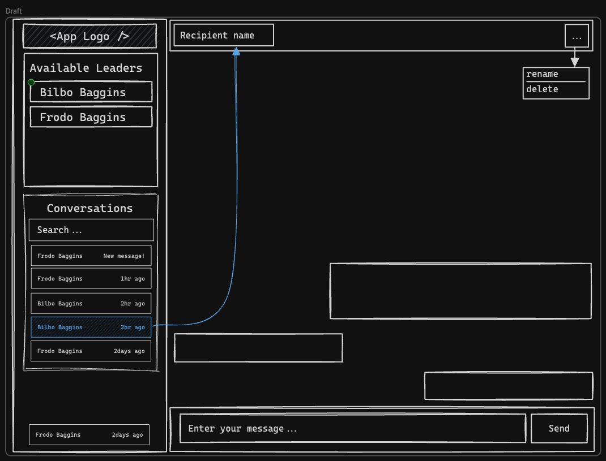

# Svelte Chat



## Technical considerations

If you have state that's important to retain within a component, consider creating an external store which would not be
replaced by HMR.

```ts
// store.ts
// An extremely simple external store
import {writable} from 'svelte/store'
export default writable(0)
```
